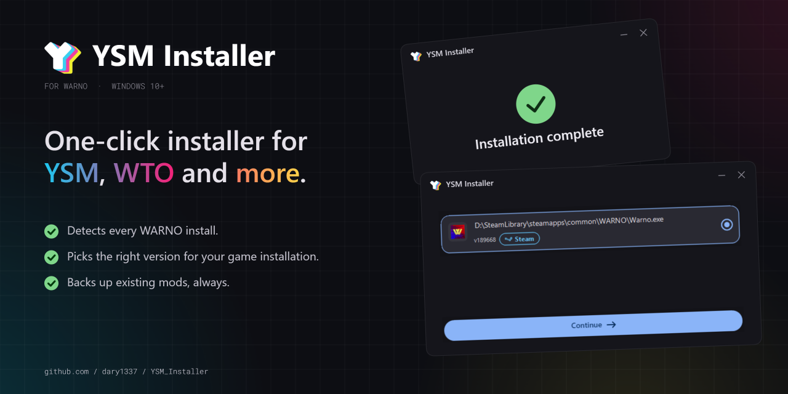

# YSM Installer

### [YSM Community](https://discord.gg/XmbhaSRqfZ)

### [YSM Repository](https://github.com/Yokaiste/YSM)

## What it does

One-click installer for **YSM**, **YSM x WiF**, **YSM x WiF x WTO**, and **WTO**. Finds your game, picks the right mod version, installs it safely, and leaves your save/config untouched.

## Features

- **Finds WARNO automatically** — works with Steam, non-Steam, and portable installs. If it misses, point it to `Warno.exe` manually or run a full-drive scan.
- **Handles multiple WARNO copies** — picks them all up and lets you choose which one to mod.
- **Knows the right mod for your version** — if WARNO is newer than the catalog, the installer falls back to the latest compatible mod and warns you. A built-in guide shows how to switch WARNO versions via Steam betas.
- **"Choose a build" screen** when several mods fit your WARNO version — with download sizes shown up front.
- **Bring your own** — install from a local folder or archive (`.zip`, `.7z`, `.rar`) if you already have one.
- **Known-issues link** — if your version has known issues, you get a one-click link to the workshop discussion before installing.
- **Safe install** — closes WARNO first, backs up your current mod config, and rolls everything back if anything fails.
- **Cancel anytime** — the progress bar has a Cancel button. Canceling restores the previous state.
- **Clear errors** — if the installer can't reach the internet, it tells you whether you're offline, the mod host (GitHub or Google Drive) is down, or just the mod list is broken, instead of a cryptic error.
- **Auto-updates** — checks for new installer versions on startup and shows the release notes before updating.
- **Settings** — switch between the official mod list and Yokaiste's GitHub releases as the source.

## Requirements

- Windows 10 or newer
- Internet connection

## What it does online

The installer goes online only to:

- get the list of supported mod versions
- download the mod archive you chose (from GitHub or Google Drive, depending on the build)
- check for installer updates
