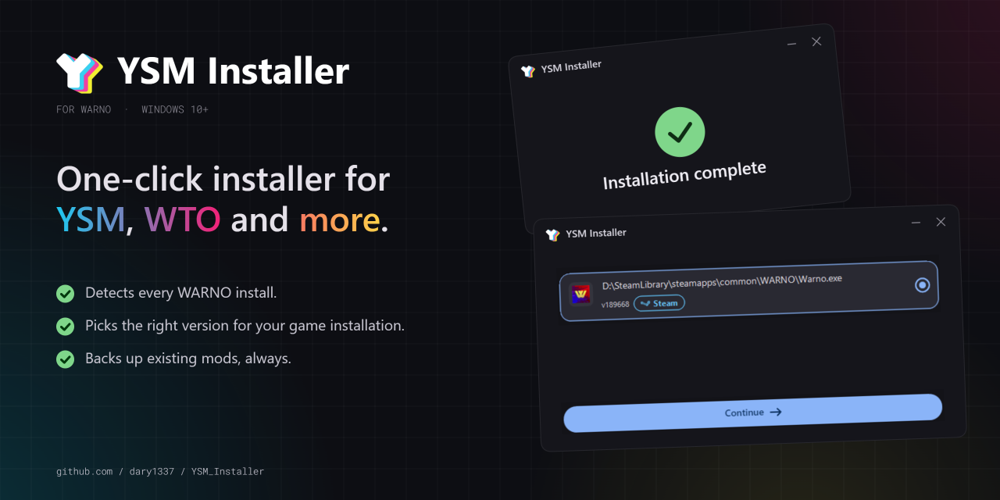

# YSM Installer

> [!IMPORTANT]
> **This is the final release — YSM Installer won't be updated anymore.**
>
> Its successor is [**Yuri's WARNO Toolkit**](https://github.com/dary1337/yuri-warno-toolkit). It keeps the
> one-click YSM install and adds a full battlegroup editor: build and edit decks straight on your profile —
> even the ones WARNO hides or won't let you import — switch game builds, and back up your whole profile.
>
> [**Get the Toolkit →**](https://github.com/dary1337/yuri-warno-toolkit)

###  [YSM Community](https://discord.gg/XmbhaSRqfZ)

### <picture><source media="(prefers-color-scheme: dark)" srcset="https://cdn.simpleicons.org/github/white" /></picture> [YSM Repository](https://github.com/Yokaiste/YSM)

## What it does

One-click installer for [**YSM**](https://steamcommunity.com/sharedfiles/filedetails/?id=3296415395), [**YSM x WiF**](https://steamcommunity.com/sharedfiles/filedetails/?id=3518369503), [**YSM x WiF x WTO**](https://steamcommunity.com/sharedfiles/filedetails/?id=3554281691), and [**WTO**](https://steamcommunity.com/sharedfiles/filedetails/?id=3387658237). Finds your game, picks the right mod version, installs it safely, and leaves your save/config untouched.

## Features

- **Finds WARNO automatically** — works with Steam, non-Steam, and portable installs. If it misses, point it to `Warno.exe` manually or run a full-drive scan.
- **Handles multiple WARNO copies** — picks them all up and lets you choose which one to mod.
- **Knows the right mod for your version** — if WARNO is newer than the catalog, the installer falls back to the latest compatible mod and warns you.
- **One-tap version switch** — when a mod needs an older WARNO, the installer switches the game to the matching Steam beta branch for you, waits for the download, and installs. No manual beta-code juggling.
- **"Choose a build" screen** when several mods fit your WARNO version — with download sizes shown up front.
- **Bring your own** — install from a local folder or archive (`.zip`, `.7z`, `.rar`) if you already have one.
- **Known-issues link** — if your version has known issues, you get a one-click link to the workshop discussion before installing.
- **Safe install** — closes WARNO first, backs up your current mod config, and rolls everything back if anything fails.
- **Cancel anytime** — the progress bar has a Cancel button. Canceling restores the previous state.
- **Clear errors** — if the installer can't reach the internet, it tells you whether you're offline, the mod host (GitHub or Google Drive) is down, or just the mod list is broken, instead of a cryptic error.

## Requirements

- Windows 10 or newer
- Internet connection

## What it leaves on your disk

Nothing but the mod itself. The installer keeps no settings folder and no registry keys — earlier versions
stored preferences under `%LOCALAPPDATA%`, and this build deletes that leftover folder on first run. Only a
log file in your temp directory remains, for troubleshooting.

## What it does online

The installer goes online only to:

- get the list of supported mod versions
- download the mod archive you chose (from GitHub or Google Drive, depending on the build)
- check for installer updates

## Like the look?

The entire interface is [**material3-dotnet**](https://github.com/dary1337/material3-dotnet) — Material 3
(Material You) for .NET desktop: themed WinForms & WPF controls with dynamic color (HCT) from one seed,
live light/dark theming, type scale, elevation, and motion. Dependency-free, MIT. Everything you see in
this installer — buttons, cards, dialogs, scrollbars, the titlebar — comes straight from the library.

## Third-party

Mod archives are extracted with [7-Zip](https://www.7-zip.org/)'s `7z.dll` (bundled, LGPL). Licenses and details: [THIRD-PARTY-NOTICES.md](THIRD-PARTY-NOTICES.md) and [licenses/](licenses/).

The interface is built on [Material3.WinForms](https://github.com/dary1337/material3-dotnet) (MIT), part of material3-dotnet.
